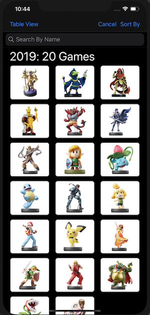

# AmiiboViewer

AmiiboViewer is any easy way to browse, search and view any Nintendo Amiibo figure released in North America, to date.

## Overview
Nintendo has been releasing their "toys-to-life" platform of Amiibos, to use with their consoles, since 2014. With each new game, and console iteration there will be a variety of Amiibos released to commemerate the release, and provide in-game bonuses for their owners. With "AmiiboViewer" you can browse through these releases by release year, game series, Amiibo series, or by name. This allows users of the iOS app to quickly find Amiibo and take a closer look. The detail view provides a larger image, as well some brief details about the figure. 

